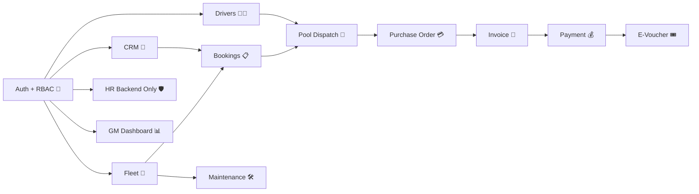

# GBCRMbyCODEX 🚐💼🤖

> Sistem CRM, Fleet, Pool Dispatch, Finance, Maintenance, dan HR backend-only untuk kebutuhan demo operasional B2B.  
> Dibangun oleh **CODEX** dengan stack **Laravel 12 + Livewire 3 + MySQL + Tailwind + Spatie Permission**. ✨

## 🌐 Repository

- GitHub: [adith92/GBCRMbyCODEX](https://github.com/adith92/GBCRMbyCODEX)
- Branch utama: `main`
- Checkpoint terbaru: `PHASE-4.2-DEMO-AUDIT-PASSED`

## 🧱 Stack Final

- `Laravel 12`
- `Livewire 3`
- `MySQL`
- `Tailwind CSS`
- `Spatie Laravel Permission`

Kenapa stack ini dipilih? ✅

- Cepat untuk bangun MVP internal yang kaya CRUD.
- Cocok untuk RBAC, operasional, dan flow bisnis bertahap.
- Aman untuk berkembang tanpa rewrite besar terlalu cepat.
- Pas untuk demo end-to-end sebelum UI polish dan deploy production.

## 🖼️ Gambaran Modul

## 🚀 Fitur Utama MVP

- 🔐 Auth + Role Based Access Control
- 👥 CRM Client + Contacts + Meeting Logs
- 🚐 Fleet / Vehicle Management
- 🧑‍✈️ Driver Management
- 📋 Booking + Dispatch Flow
- 🧭 Pool Queue + Assign Driver/Vehicle
- 💳 Purchase Order
- 🧾 Invoice
- 💰 Payment Partial / Full
- 🎟️ E-Voucher
- 🛠️ Maintenance Flow
- 🛡️ HR backend-only untuk Super Admin
- 📊 Dashboard KPI + drill-down
- 🧪 Demo Seeder + QA Docs

## 🧭 Demo Flow Utama

1. `GM Dashboard` untuk lihat KPI bisnis 📊
2. `Sales` buat booking baru 📝
3. `Pool` assign driver + vehicle 🚐
4. Booking dikonfirmasi ✅
5. `Finance` buat PO → Invoice → Payment 💳🧾💰
6. `E-Voucher` dipakai untuk skenario payment tertentu 🎟️
7. `Operation` jalankan maintenance kendaraan 🛠️
8. `Super Admin` buka HR backend-only 🛡️

## 👤 Demo Accounts

Semua akun demo menggunakan password: `password`

- `superadmin@blueerp.test`
- `gm@blueerp.test`
- `salesmanager@blueerp.test`
- `sales@blueerp.test`
- `finance@blueerp.test`
- `operation@blueerp.test`
- `headpool@blueerp.test`
- `poolstaff@blueerp.test`

## 📂 File Penting

- [PROJECT_MASTERPLAN.md](./PROJECT_MASTERPLAN.md) — arah besar project
- [PROJECT_PRD.md](./PROJECT_PRD.md) — requirement produk
- [AGENTS.md](./AGENTS.md) — instruksi agent workspace
- [CHECKPOINT_CURRENT.md](./CHECKPOINT_CURRENT.md) — checkpoint aktif terbaru
- [docs/CODEX_MASTER_PROMPT.md](./docs/CODEX_MASTER_PROMPT.md) — prompt kerja Codex
- [docs/DEMO_SCRIPT_PAK_KOBI.md](./docs/DEMO_SCRIPT_PAK_KOBI.md) — script demo stakeholder
- [docs/QA_CHECKLIST.md](./docs/QA_CHECKLIST.md) — checklist QA internal

## 🧪 Status Saat Ini

- Checkpoint audit demo: `PHASE-4.2-DEMO-AUDIT-PASSED`
- Baseline validasi sebelumnya tercatat: `82 tests passed`
- Fokus berikutnya: `Google Stitch UI Polish + Railway Deployment Prep`

## ⚠️ Prinsip Penting

- Jangan pindah stack dulu.
- Jangan expose HR ke non-super-admin.
- Jangan commit secrets.
- Jangan refactor besar tanpa alasan bug yang jelas.
- Fokus selalu ke flow demo yang bisa dipresentasikan dengan nyaman.

## ❤️ Built By CODEX

Project ini dibangun, dirapikan, dan didorong checkpoint demi checkpoint oleh **CODEX** sebagai coding partner implementasi.  
Targetnya bukan cuma kode jalan, tapi juga repo yang rapi, demo yang siap dipresentasikan, dan flow bisnis yang gampang di-follow. 🤝
