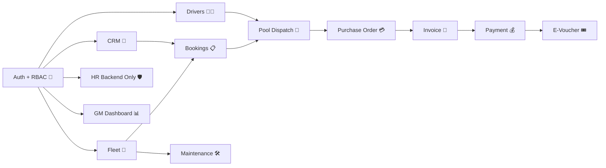

# GBCRMbyCODEX 🚐💼🤖


> Sistem CRM, Fleet, Pool Dispatch, Finance, Maintenance, dan HR backend-only untuk kebutuhan demo operasional B2B.  
> Dibangun oleh **CODEX** dengan stack **Laravel 12 + Livewire 3 + MySQL + Tailwind + Spatie Permission**. ✨

## 🌐 Repository

- GitHub: [adith92/GBCRMbyCODEX](https://github.com/adith92/GBCRMbyCODEX)
- Branch utama: `main`
- Live demo Railway: [web-production-c81b8.up.railway.app](https://web-production-c81b8.up.railway.app)
- Checkpoint platform terakhir: `PHASE-6.4-NAVIGATION-SEARCH-ACTIVITY-COMPLETE`
- Upgrade UI/UX saat ini: `Checkpoint 6.1 + 6.4`

## 🧱 Stack Final

- `Laravel 12`
- `Livewire 3`
- `MySQL`
- `Tailwind CSS`
- `Spatie Laravel Permission`

Kenapa stack ini dipilih? ✅

- Cepat untuk bangun MVP internal yang kaya CRUD.
- Cocok untuk RBAC, operasional, dan flow bisnis bertahap.
- Aman untuk berkembang tanpa rewrite besar terlalu cepat.
- Pas untuk demo end-to-end sebelum UI polish dan deploy production.

## 🖼️ Gambaran Modul



## 🚀 Fitur Utama MVP

- 🔐 Auth + Role Based Access Control
- 👥 CRM Client + Contacts + Meeting Logs
- 🚐 Fleet / Vehicle Management
- 🧑‍✈️ Driver Management
- 📋 Booking + Dispatch Flow
- 🧭 Pool Queue + Assign Driver/Vehicle
- 💳 Purchase Order
- 🧾 Invoice
- 💰 Payment Partial / Full
- 🎟️ E-Voucher
- 🛠️ Maintenance Flow
- 🛡️ HR backend-only untuk Super Admin
- 📊 Dashboard KPI + drill-down
- 🔎 Global Search lintas modul yang permission-aware
- 🕘 Recent Activity timeline lintas workflow
- 🧪 Demo Seeder + QA Docs

## 🧭 Demo Flow Utama

1. `GM Dashboard` untuk lihat KPI bisnis 📊
2. `Sales` buat booking baru 📝
3. `Pool` assign driver + vehicle 🚐
4. Booking dikonfirmasi ✅
5. `Finance` buat PO → Invoice → Payment 💳🧾💰
6. `E-Voucher` dipakai untuk skenario payment tertentu 🎟️
7. `Operation` jalankan maintenance kendaraan 🛠️
8. `Super Admin` buka HR backend-only 🛡️

## 👤 Demo Accounts

Semua akun demo menggunakan password: `password`

- `superadmin@blueerp.test`
- `gm@blueerp.test`
- `salesmanager@blueerp.test`
- `sales@blueerp.test`
- `finance@blueerp.test`
- `operation@blueerp.test`
- `headpool@blueerp.test`
- `poolstaff@blueerp.test`

## 📂 File Penting

- [PROJECT_MASTERPLAN.md](./PROJECT_MASTERPLAN.md) — arah besar project
- [PROJECT_PRD.md](./PROJECT_PRD.md) — requirement produk
- [AGENTS.md](./AGENTS.md) — instruksi agent workspace
- [CHECKPOINT_CURRENT.md](./CHECKPOINT_CURRENT.md) — checkpoint aktif terbaru
- [docs/CODEX_MASTER_PROMPT.md](./docs/CODEX_MASTER_PROMPT.md) — prompt kerja Codex
- [docs/DEMO_SCRIPT_PAK_KOBI.md](./docs/DEMO_SCRIPT_PAK_KOBI.md) — script demo stakeholder
- [docs/QA_CHECKLIST.md](./docs/QA_CHECKLIST.md) — checklist QA internal

## 🌱 Scalable Demo Seeder

Environment variables yang didukung:

- `ENABLE_DEMO_SEED=true/false`
- `DEMO_SEED_MODE=demo|stress`
- `DEMO_CUSTOMER_COUNT=50` untuk demo mode, atau `1200` default efektif untuk stress mode bila tidak diisi

Mode yang tersedia:

- `demo`: curated dataset untuk flow presentasi, dengan sekitar 10-50 client dan data operasional yang tetap realistis.
- `stress`: dataset besar untuk uji pagination, search, dan performa awal. Default menghasilkan minimal 1200 client, 150-250 contact, 100-200 meeting log, 50-100 booking, dan 30-60 invoice.

Rekomendasi penggunaan:

- Demo stakeholder: `DEMO_SEED_MODE=demo` ✅
- Uji performa awal: `DEMO_SEED_MODE=stress` ⚡

## 🧪 Status Saat Ini

- Railway deploy aktif dan smoke test inti sebelumnya sudah berhasil
- CRUD + business flow utama sudah mencakup:
  - Auth + RBAC
  - CRM
  - Fleet
  - Drivers
  - Booking + Pool Dispatch
  - Finance Flow
  - Maintenance
  - HR backend-only
- Upgrade navigasi, detail-page enrichment, global search, dan recent activity sudah selesai untuk phase 6
- Full validation terbaru dari clone stabil: `90 tests passed`
- Full build summary tersedia di:
  - [docs/FULL_BUILD_SUMMARY.md](./docs/FULL_BUILD_SUMMARY.md)

## ⚠️ Prinsip Penting

- Jangan pindah stack dulu.
- Jangan expose HR ke non-super-admin.
- Jangan commit secrets.
- Jangan refactor besar tanpa alasan bug yang jelas.
- Fokus selalu ke flow demo yang bisa dipresentasikan dengan nyaman.

## ❤️ Built By CODEX

Project ini dibangun, dirapikan, dan didorong checkpoint demi checkpoint oleh **CODEX** sebagai coding partner implementasi.  
Targetnya bukan cuma kode jalan, tapi juga repo yang rapi, demo yang siap dipresentasikan, dan flow bisnis yang gampang di-follow. 🤝

## Railway Deploy 🚂

### Quick Deploy Flow

1. Deploy from GitHub repo: [adith92/GBCRMbyCODEX](https://github.com/adith92/GBCRMbyCODEX)
2. Add a MySQL database service in Railway
3. Fill required environment variables from `.env.railway.example`
4. Generate app key locally:

```bash
php artisan key:generate --show
```

5. Set build command:

```bash
composer install --no-interaction --prefer-dist --optimize-autoloader
npm install
npm run build
```

6. Set pre-deploy command:

```bash
sh railway/init-app.sh
```

7. Generate a public Railway domain
8. Set `APP_URL` to that Railway domain
9. If you want seeded data, set the seed flags:

```bash
ENABLE_DEMO_SEED=true
DEMO_SEED_MODE=demo
DEMO_CUSTOMER_COUNT=50
```

Use `DEMO_SEED_MODE=demo` for normal stakeholder walkthroughs.
Use `DEMO_SEED_MODE=stress` for heavier pagination/search validation.
When stress mode is enabled and `DEMO_CUSTOMER_COUNT` is empty, the seeder defaults to 1200 clients.

### Smoke Test Checklist

- Login page opens ✅
- Dashboard opens ✅
- Bookings page opens ✅
- Finance page opens ✅
- Maintenance page opens ✅
- No obvious 500 error in logs ✅
- Logout works ✅

### Deployment Docs

- Detailed guide: [docs/RAILWAY_DEPLOYMENT.md](./docs/RAILWAY_DEPLOYMENT.md)

## 🧾 Build Summary

Kalau kamu ingin lihat hasil pembangunan project dari awal sampai state sekarang, buka:

- [docs/FULL_BUILD_SUMMARY.md](./docs/FULL_BUILD_SUMMARY.md)

Dokumen ini merangkum:

- checkpoint per fase
- fitur yang sudah selesai
- runtime/deployment fixes
- status validasi
- progress UI/UX terbaru
