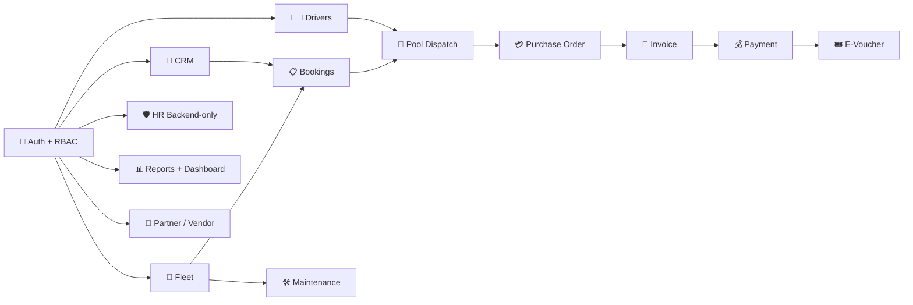

# BBCodex / GBCRMbyCODEX 🚖✨📊


> **BBCodex** adalah CRM operasional B2B untuk client management, fleet, dispatch, finance, maintenance, dan HR backend-only.  
> Fondasinya tetap **Laravel 12 + Livewire 3 + MySQL + Spatie Permission**, tetapi rasa UX-nya didorong ke arah **command center premium**: cepat, modern, visual, drill-down friendly, dan tetap aman untuk backend. 💙

## 🌐 Repo & Demo

| Item | Value |
|---|---|
| GitHub | [adith92/GBCRMbyCODEX](https://github.com/adith92/GBCRMbyCODEX) |
| Branch utama | `main` |
| Nama produk | `BBCodex` |
| Live demo | [gbdemo01.up.railway.app](https://gbdemo01.up.railway.app) |
| Checkpoint aktif | `PHASE-8.0-PRODUCTION-GRADE-PREMIUM-UX-COMPLETE` |
| Validation terbaru | `96 tests passed` ✅ |

## 🧱 Stack Utama

- `Laravel 12`
- `Livewire 3`
- `MySQL`
- `Tailwind CSS`
- `Spatie Laravel Permission`
- `GitHub Actions CI`
- `Railway Deployment`

## 🎯 Tujuan Produk

BBCodex dibangun untuk menyatukan alur berikut dalam satu workspace:

- 👥 CRM client + contact + meeting follow-up
- 🚐 Fleet & vehicle readiness
- 🧑‍✈️ Driver management
- 📋 Booking pipeline
- 🧭 Pool dispatch / assign driver-vehicle
- 💳 Finance flow end-to-end
- 🛠️ Maintenance control
- 🛡️ HR backend-only
- 🔎 Global search & activity drill-down
- 📈 Sales performance & reports dashboard
- 🤝 Partner / Vendor support network

## 🗺️ Architecture Overview



## 🧩 Feature Matrix

| Module | Status | Catatan |
|---|---|---|
| Auth + RBAC | ✅ | Spatie Permission, granular role/permission |
| CRM Clients | ✅ | Client list, detail, contacts, meeting logs |
| Partners / Vendors | ✅ | Modul tambahan untuk supplier/workshop/partner support |
| Fleet Vehicles | ✅ | Index, detail, filter, clickable records |
| Drivers | ✅ | Index, detail, status/license visibility |
| Bookings | ✅ | Create, assign, confirm, cancel, finance linkage |
| Pool Dispatch | ✅ | Queue, assign, guard status, audit trail visual |
| Purchase Orders | ✅ | Create from confirmed booking, approval flow |
| Invoices | ✅ | From approved PO, payment integration |
| Payments | ✅ | Partial/full payment, overpay guard |
| E-Vouchers | ✅ | Voucher payment support |
| Maintenance | ✅ | Vehicle state protection + visual timeline |
| HR Backend-only | ✅ | Super-admin only |
| Global Search | ✅ | Permission-aware + scope filter + Cmd+K feel |
| Recent Activity | ✅ | Filtered drill-down timeline |
| Reports Dashboard | ✅ | Real insight dashboard, bukan placeholder |
| Sales Performance | ✅ | Roster + performance page |
| Demo Seeder | ✅ | Demo + stress mode |
| GitHub CI | ✅ | Install, build, seed, test |
| Railway Deploy | ✅ | Live demo tersedia |

## 👮 Role Matrix Ringkas

| Role | Fokus Utama | Akses Khas |
|---|---|---|
| `super-admin` | kontrol penuh | semua modul + HR |
| `gm` | executive overview | dashboard, reports, finance visibility, sales performance |
| `sales-manager` | pipeline & team | clients, meeting logs, bookings, sales performance |
| `sales` | growth execution | clients, meeting logs, bookings, own performance |
| `finance` | collection & billing | PO, invoice, payment, voucher, finance dashboard |
| `operation` | readiness & service | fleet, drivers, maintenance |
| `head-pool` | dispatch control | pool queue, assignment, vehicle readiness |
| `pool-staff` | dispatch execution | queue operasional dan assignment terbatas |

## ✨ UX Premium Highlights

- 🎛️ **Dashboard hero command center** per role
- 🧭 **Sidebar modern** dengan active state tegas
- 📱 **Mobile overlay sidebar**
- ⌘ **Cmd+K style command palette**
- 🎭 **Demo role switcher** khusus demo env
- ♻️ **Reset demo seed button** khusus demo env dan super-admin
- 📊 **Compact KPI system** dengan drill-down
- 📈 **Revenue trend visual** yang benar-benar hidup
- 🤝 **Partner / Vendor module**
- 🕘 **Activity timeline** lebih visual
- 🛠️ **Maintenance detail** lebih readable
- 🧾 **PO approval timeline**
- 🚚 **Dispatch audit trail** visual
- 🖨️ **Print-friendly detail pages**

## 🧪 Demo Accounts

Semua akun demo default memakai password: `password`

| Role | Email |
|---|---|
| Super Admin | `superadmin@blueerp.test` |
| GM | `gm@blueerp.test` |
| Sales Manager | `salesmanager@blueerp.test` |
| Sales | `sales@blueerp.test` |
| Finance | `finance@blueerp.test` |
| Operation | `operation@blueerp.test` |
| Head Pool | `headpool@blueerp.test` |
| Pool Staff | `poolstaff@blueerp.test` |

## 🚀 Demo Flow Utama

1. 👔 GM buka **Dashboard** untuk lihat KPI dan command center.
2. 🤝 Sales buka **CRM** lalu buat / follow-up client.
3. 📋 Sales buat **Booking**.
4. 🧭 Pool assign **Driver + Vehicle**.
5. ✅ Booking di-confirm.
6. 💳 Finance buat **PO** dari booking confirmed.
7. 🧾 Finance generate **Invoice** dari PO approved.
8. 💰 Finance record **Payment** partial / full.
9. 🎟️ Jika perlu, payment bisa pakai **E-Voucher**.
10. 🛠️ Operation pantau **Maintenance** dan state kendaraan.
11. 🛡️ Super Admin bisa buka **HR Backend-only**.

## 🌱 Scalable Demo Seeder

Environment flags yang didukung:

- `ENABLE_DEMO_SEED=true/false`
- `DEMO_SEED_MODE=demo|stress`
- `DEMO_CUSTOMER_COUNT=1200`

Mode:

| Mode | Tujuan | Karakteristik |
|---|---|---|
| `demo` | stakeholder walkthrough | curated flow dengan default 1000+ client, tapi booking/finance tetap realistis dan ringan untuk presentasi |
| `stress` | early performance test | 1000+ client, search/pagination/load lebih berat |

Rekomendasi:

- 🎬 Demo stakeholder: `DEMO_SEED_MODE=demo`
- ⚙️ Load / pagination validation: `DEMO_SEED_MODE=stress`

## ✅ Validation Status Terbaru

Validation terakhir dari clone sehat:

| Command | Result |
|---|---|
| `composer install --no-interaction --prefer-dist` | ✅ |
| `npm install` | ✅ |
| `php artisan optimize:clear` | ✅ |
| `php artisan migrate:fresh --seed` | ✅ |
| `npm run build` | ✅ |
| `php artisan test` | ✅ |

**Final result:** `96 passed` / `253 assertions` 🎉

## 🚂 Railway Deploy

### Quick Flow

1. Deploy dari GitHub repo ini
2. Tambah MySQL service
3. Isi env dari `.env.railway.example`
4. Generate `APP_KEY`
5. Set `APP_URL`
6. Jalankan startup via `railway/init-app.sh`
7. Aktifkan demo flags bila perlu

### Demo flags untuk Railway

```bash
ENABLE_DEMO_SEED=true
DEMO_SEED_MODE=demo
DEMO_CUSTOMER_COUNT=1200
```

### Docs

- [docs/RAILWAY_DEPLOYMENT.md](./docs/RAILWAY_DEPLOYMENT.md)

## 🔁 GitHub CI

Workflow CI tersedia di:

- `.github/workflows/ci.yml`

Yang dijalankan:

- `composer install`
- `npm install`
- `php artisan optimize:clear`
- `php artisan migrate:fresh --seed`
- `npm run build`
- `php artisan test`

## 📚 Dokumen Penting

- [PROJECT_MASTERPLAN.md](./PROJECT_MASTERPLAN.md)
- [PROJECT_PRD.md](./PROJECT_PRD.md)
- [CHECKPOINT_CURRENT.md](./CHECKPOINT_CURRENT.md)
- [CHANGELOG.md](./CHANGELOG.md)
- [docs/FULL_BUILD_SUMMARY.md](./docs/FULL_BUILD_SUMMARY.md)
- [docs/FINAL_DEMO_REVIEW_PACK.md](./docs/FINAL_DEMO_REVIEW_PACK.md)
- [docs/DEMO_SCRIPT_PAK_KOBI.md](./docs/DEMO_SCRIPT_PAK_KOBI.md)
- [docs/QA_CHECKLIST.md](./docs/QA_CHECKLIST.md)

## ❤️ Built by CODEX

Project ini dibangun dan di-upgrade secara bertahap oleh **CODEX** sebagai coding partner implementasi.  
Fokusnya bukan cuma “fitur jalan”, tapi juga:

- backend yang tetap kuat 🔐
- flow demo yang mudah dipresentasikan 🎬
- UX yang modern dan lebih hidup ✨
- repo yang rapi untuk scale-up berikutnya 🚀
